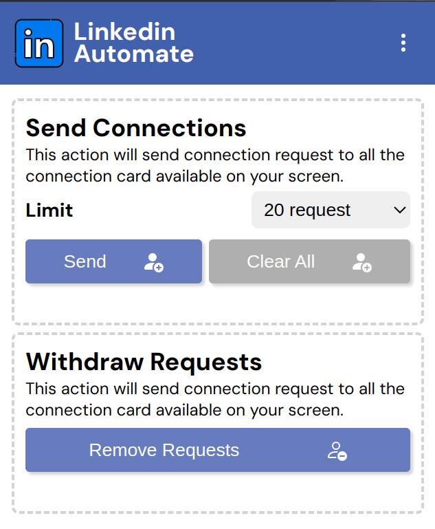

# Linkedin Automate

A Linkedin Automation Extension to Automate the tidious works such as send connection requests, delete all pending sent requests and much more.

## Features

- Automate your connection requests by a single click without any tidious process.
- Clear unresponding connection requests.( Coming Soon... )
- Auto Apply all the Easy Apply Option Jobs.( Coming Soon... )
- Like All the Linkedin Posts of Other.( Coming Soon... )
- Commenting On The Linkedin Posts.( Coming Soon... )

## Screenshots

  
  
  

## Getting Started

1. Download this repository and extract at a folder(should not be deleted till you use this extension).
2. Open Chrome Manage Extensions
3. Enable Development Mode
4. Load the Extension from folder as demo.
5. Now click on button after ( preferred visit the my network tab then click send ).

## Contributing

Contributions are welcome! If you have any ideas, suggestions, or improvements, feel free to open an issue or submit a pull request.

